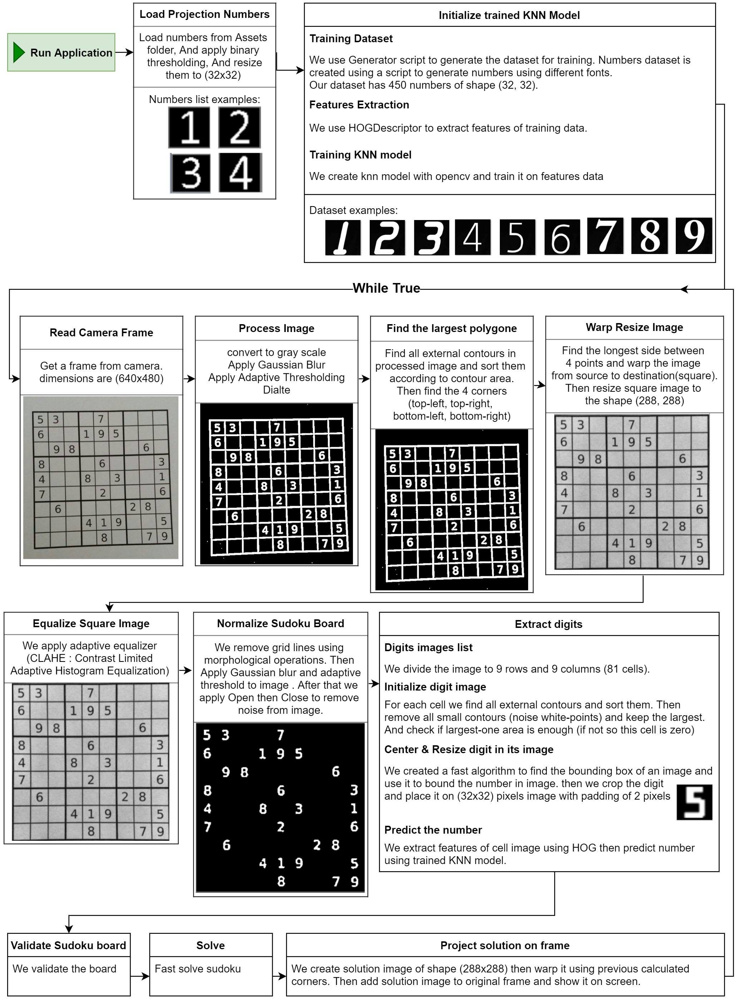

# Sudoku-Solver
Realtime sudoku solver using OpenCV

# Features:
- program is optimized for speed (realtime solving).
- press P to pause camera frame and see solution.
- press O to enable OrientationSolveMode (Now you can rotate sudoku board as you want, but this mode is slower than normal mode).
- press Space to exit.

# How it works?

